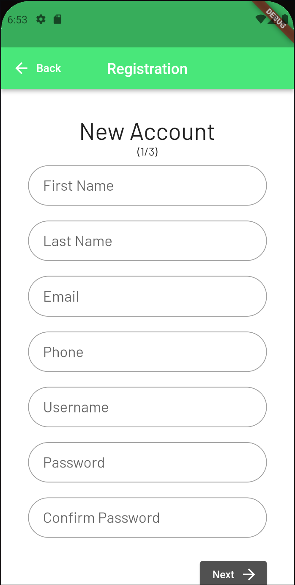

# Delivery App Android Mobile Application

## Overview

This repository contains the source code for a Delivery  App on Android and IOS. The front and back end of this application were created using two different frameworks. Django was used for the backend and frontend wile Flutter was used just for the frontend, and will be kept inside different folders.

## Screenshots

### First Connectivity Test (6/6/2022):

Here, data (i.e. notes) was successfully retrieved from the backend and displayed as organized text on the frontend Android App

### Login Page Visuals Created (6/9/2022):

### State of App (6/21/2022):

User is now able to log in and and access the homepage if they are registered. Currently, the map defaults to displaying only one location (San Francisco) and user registration is not possible through the mobile app.

#### Login Page:

Frontend- near completion
 
Backend- complete
 
Connection- functional

#### Registration Pages:

Frontend- near completion
 
Backend- complete
 
Connection- not yet made

#### Homepage:
Frontend- needs work
 
Backend- still needs data
 
Connection- functional

### State of App (7/11/2022):

User is now able to log in with an email, register an account, and view their account info (still needs styling) after logging in. 

#### Homepage (Map Section):

